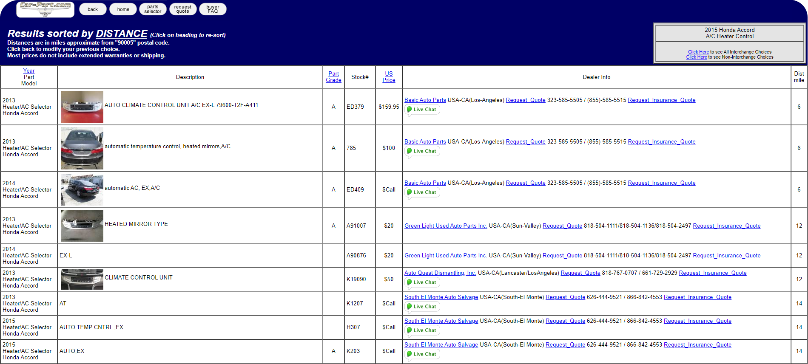
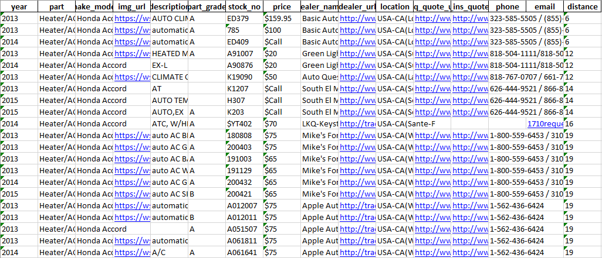

# www.car-part.com scraper

# Introduction
This is a project to scrape pricing info for products available for sale on car-parts.com for user-defined year-make_model-part-location combinations. The end result is an Excel file containing the data in an organized format for viewing and further analysis.

- Scraping the website does not appear to violate TOS or robots.txt.

# Requirements
Google Chrome and chromedriver executable compatible with Chrome version (https://chromedriver.chromium.org/downloads).

install required
- selenium
- bs4

stock python 3
- pathlib
- numpy
- pandas
- time
- datetime
- importlib
- logging

# Usage
- The user can place plugin files in the plugins folder and the main program file **car_part_scraper.py** will scrape info from the site based on these user-defined inputs.
- The provided sample plugins obtain data for:

  | Year | Make & Model | Part  | Zip Code |
  |------|--------------|-------|----------|
  | 2015 | Honda Accord | A/C Heater Control (see also Radio or TV Screen) | 90005    |
  | 2016 | Toyota Camry | Console, Front | 60603    |

# Example Website Detail

# Example Output
